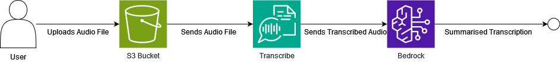

# Call/Audio LLM Summariser

<!-- TABLE OF CONTENTS -->
<details open="open">
  <summary>Table of Contents</summary>
  <ol>
    <li><a href="#overview">Overview</a></li>
    <li>
      <a href="#getting-started">Getting Started</a>
      <ul>
        <li><a href="#prerequisites">Prerequisites</a></li>
        <li><a href="#installation">Installation</a></li>
      </ul>
    </li>
  </ol>
</details>

<!-- Overview -->
## Overview

*The following solution focuses on utilising AWS Transcribe and AWS Bedrock to transcribe calls/audio while providing an effective summary based on business needs.*




<!-- GETTING STARTED -->
## Getting Started

### Prerequisites

The following are the requirements to run the code:

* Config file of the following format:
```sh
   {
    "ACCESS_KEY": "account_access_key_environmental_variable",
    "SECRET_KEY": "account_secret_key_environmental_variable",
    "S3_BUCKET": "storing_s3_bucket_environmental_variable"
    }
```
1. From the config above, the configs provided are values of environmental variables that point to the following credentials

### Installation

1. Clone the repo

   ```sh
   git clone https://github.com/leart-k/calls-summariser.git
   ```

1. Install the requirements:
    1. pip install -r requirements.txt

